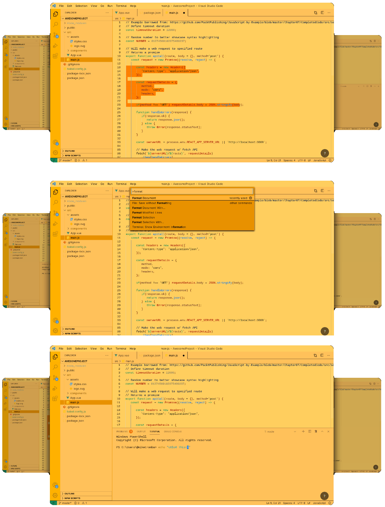

# VS Code Flux Intense

This is a simple theme for VS Code to reduce eye strain.

Inspired by the effect created by F.lux and Windows Night Light.

This is the first extension that helps you reduce eye strain when programming. The most eye-straining colors are blue, red, dark orange. In combination with a light yellowing orange the colors of the theme will reduce eye strain. It changing the most eye-straining colors of VS Code to colors that are easier on the eyes.
